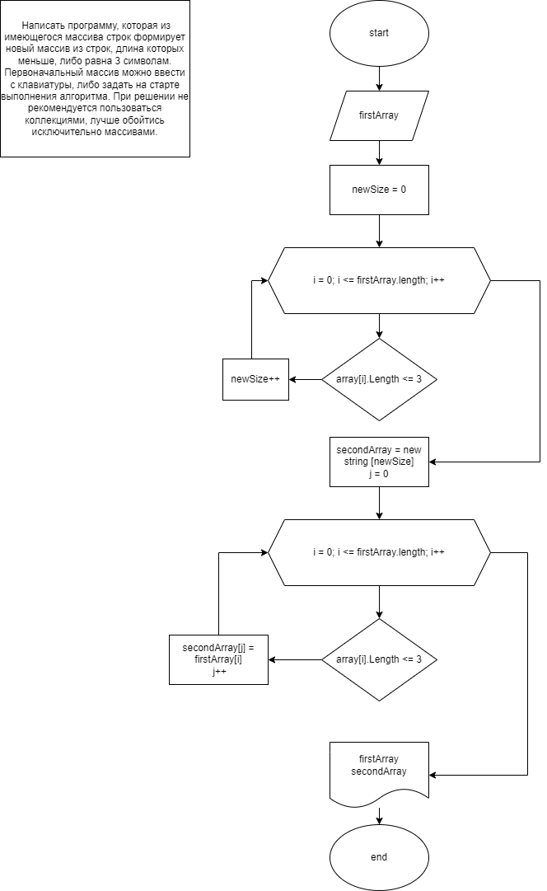
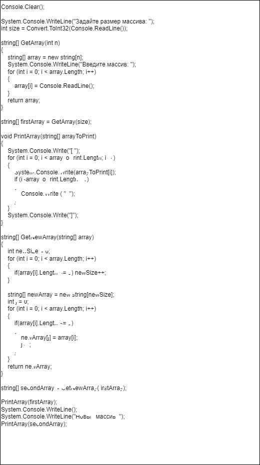
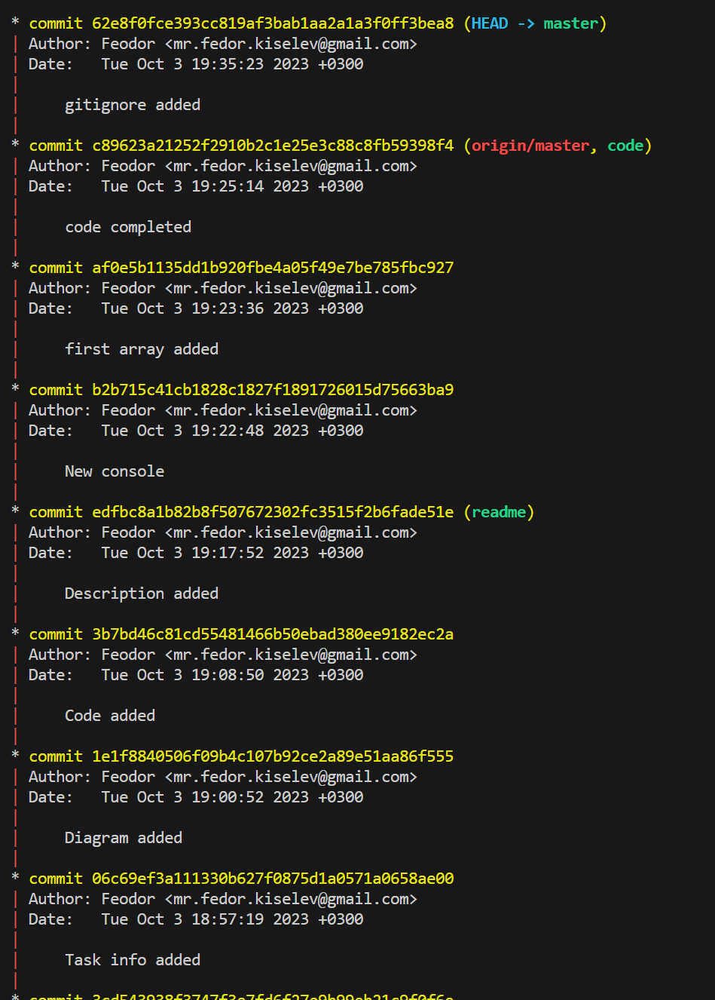

# Решение

## Условие задачи

Написать программу, которая из имеющегося массива строк формирует новый массив из строк, длина которых меньше, либо равна 3 символам.
Первоначальный массив можно ввести с клавиатуры, либо задать на старте выполнения алгоритма.
При решении не рекомендуется пользоваться коллекциями, лучше обойтись исключительно массивами.

## Блок схема

## Код 

## Описание кода

Во время выполнения программы, пользователь введет размер и данные массива. После чего программа сформирует новый массив с длиной элементов <= 3 из имеющихся данных и выведит его на экран.

## Коммиты

